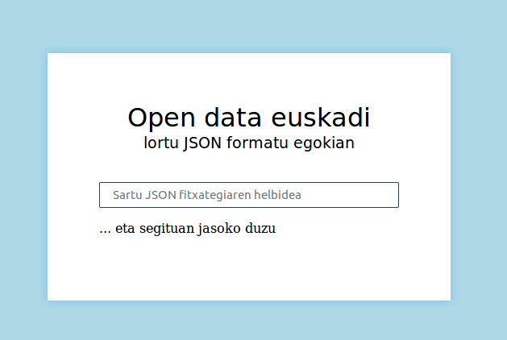
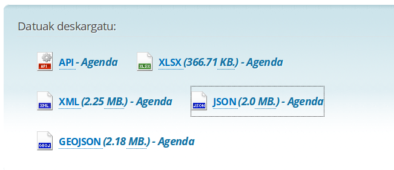
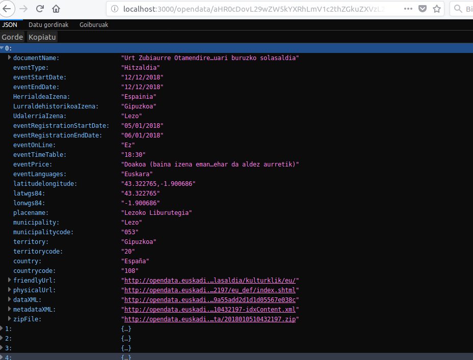

# Opendata euskadi proxy

http://opendata.euskadi.eus webgunean euskadiko hainbat datu ireki eskeintzen dira, baina JSON formatuan dauden datuak eskuratu nahi direnean, fitxategia ez dago formatu egoki batean.

Honek datu hoietan oinarrituta dauden aplikazio berriak sortzeko orduan arazo bat suposatzen du.

Hau dela eta aplikazio honen helburua, Opendata euskadiko JSON fitxategiak formatu egoki batera bihurtzea da, bihurtutako fitxategiaren esteka eskeiniz.

## Aplikazioaren esteka

Aplikazioa heroku plataforman dago erabilgarri http://opendata-euskadi.herokuapp.com/

## Instalazioa

Zure ordenagailuan instalatzeko, momentuko [Node.js](https://nodejs.org) bertsio berriena edo gutxienez 9.4.0-duna eduki behar da.

Terminalaren bitartez `npm install` komandoa exekutatuko dugu dependentziak deskargatzeko.

Gero martxan jartzeko `npm start`exekutatu eta nabigatzaile batean http://localhost:3000 helbidean zabalduko zaigu web aplikazioa.

## Erabilera

http://opendata.euskadi.eus webgunetik `geojson` edo `json` formatuan dagoen fitxategiaren esteka bat bilatu eta aplikazio honetan sartu.

Segituan formatu egokia duen fitxategi bat agertuko da. Fitxategi horren esteka erabili dezakegu garatuko dugun aplikazioetan erabiltzeko.

